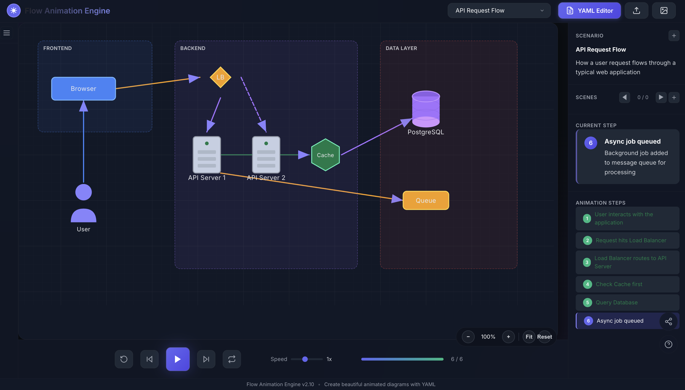

# 🎬 Kubernetes Animation Engine

> A minimal, clean, and playful animation sandbox for visualizing Kubernetes concepts with smooth visuals and an intuitive structure.

[](https://animator-lemon.vercel.app/)
[](https://vitejs.dev/)
[](https://greensock.com/gsap/)

---



## ✨ Features

- 🎯 **Interactive Animations** — Visualize Kubernetes concepts in motion
- ⚡ **Lightning Fast** — Powered by Vite for instant hot reload
- 🎨 **Vanilla JS + CSS** — Easy to understand and customize
- 📦 **Lightweight** — Minimal dependencies, maximum performance
- 🔧 **Extensible Scenarios** — Add your own animation scenarios

---

## 🚀 Quick Start

```bash
# Clone the repository
git clone https://github.com/your-username/Animation.git
cd Animation

# Install dependencies
npm install

# Start development server
npm run dev
```

Open [http://localhost:5173](http://localhost:5173) in your browser.

---

## 📂 Project Structure

```
Animation/
├── 📄 index.html        # Entry page
├── 🎨 style.css         # Styling and animation rules
├── ⚙️  main.js           # Core animation logic
├── 📁 assets/           # Images and static assets
├── 📁 scenarios/        # Animation scenarios
├── 📁 engine/           # Animation engine core
└── 📁 dist/             # Production build output
```

---

## 🛠️ Available Scripts

| Command | Description |
|---------|-------------|
| `npm run dev` | Start development server with hot reload |
| `npm run build` | Build for production |
| `npm run preview` | Preview production build locally |

---

## 🌐 Deployment

This project is deployed on **Vercel**:

🔗 **Live Demo:** [https://animator-lemon.vercel.app/](https://animator-lemon.vercel.app/)

To deploy your own instance:

```bash
npm run build
npx vercel --prod
```

---

## 🧰 Tech Stack

| Technology | Purpose |
|------------|---------|
| [Vite](https://vitejs.dev/) | Build tool & dev server |
| [GSAP](https://greensock.com/gsap/) | Animation library |
| [js-yaml](https://github.com/nodeca/js-yaml) | YAML parsing for scenarios |
| Vanilla JS | Core logic |
| CSS3 | Styling & transitions |

---

## 📝 License

MIT © 2024

---

<p align="center">
  Made with ❤️ for Kubernetes learners
</p>
